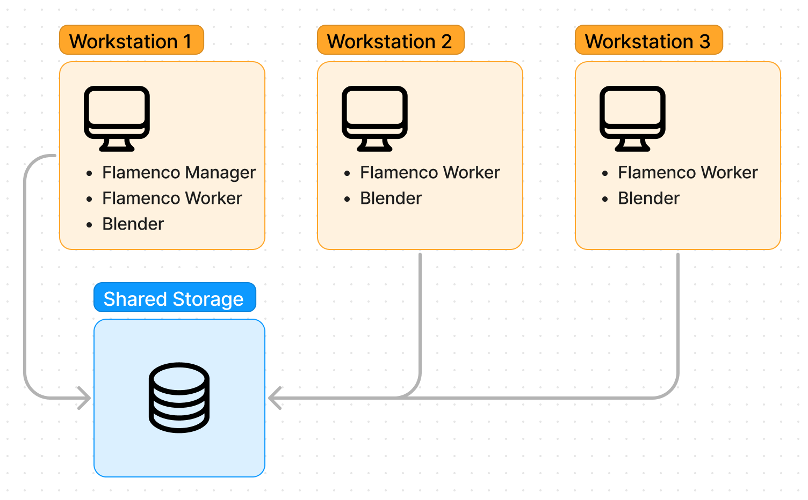

 <!-- begin columns block -->
Flamenco is a lightweight, cross-platform framework to dispatch and schedule rendering jobs for smaller teams, or individuals. 

[Blender Studio][studio] uses Flamenco in production with a handful of servers 
(scaling up to hundreds of servers on demand), and combines those with desktop 
workstations when they're not used by the artists.

The Flamenco project distributes executables and a Blender add-on 
to install and run ([downloads][downloads]).

As the Blender.org project is built on free and Open Source software, Linux is
the main platform Flamenco is developed against. Windows and MacOS will also be
supported, but on a best-effort basis with help from the community.

[downloads]: 

[studio]: https://studio.blender.org/

<---> <!-- magic separator, between columns -->

Example of a Flamenco configuration.



## Design Principles

The following principles guide the design of Flamenco:

 <!-- begin columns block -->

### Blender.org Project
Flamenco is a true blender.org project. This means that it's Free and Open
Source, made by the community, lead by Blender HQ. Its development will fall
under the umbrella of the [Pipline, Assets & IO][PAIO] module.

[PAIO]: https://projects.blender.org/blender/blender/wiki/Module:%20Pipeline,%20Assets%20&%20I/O

### Minimal Authentication & Organisation
Because Flamenco is aimed at small studios and individuals, it won't offer
much in terms of user authentication, nor the organisation of users into groups.
[Custom job types][jobtypes] can be used to attach arbitrary metadata to jobs,
such as the submitter's name, a project identifier, etc.

[jobtypes]: 

### Minimize External Components
Running Flamenco should be extremely simple. This means that it should depend
on as few external packages as possible. Apart from the Flamenco components
themselves, all you need to install is [Blender][blender].
The downside of this is that development might take longer, as some things
that an external service could solve need to be implemented. This trade-off of
developer time for simplicity of use is considered a good thing, though.

[blender]: https://www.blender.org/

<---> <!-- magic separator, between columns -->

### No Errors, Guide Users To Success
Instead of stopping with a description of what's wrong, like "no database
configured", Flamenco should show something helpful in which you're guided
towards a working system.

### Customisable
Studio pipeline developers / TDs should be able to customise the behaviour of
Flamenco. They should be able to create new [job types][jobtypes], and adjust
existing job types to their needs. For this, Flamenco uses JavaScript to convert
a job definition like "*render this blend file, frames 1-100*" into individual
tasks for computers to execute.

[jobtypes]: 

### Work offline
Like Blender itself, Flamenco should be able to fully work offline. That is,
work without internet connection. If any future feature should need such a
connection, that feature should always be optional, and be disabled by default.

### Data Storage
Data should be stored as plain files whenever possible. Where a higher level
of coordination is required, an embedded database can be used; currently
Flamenco uses [SQLite][sqlite] for this.

[sqlite]: https://pkg.go.dev/modernc.org/sqlite



