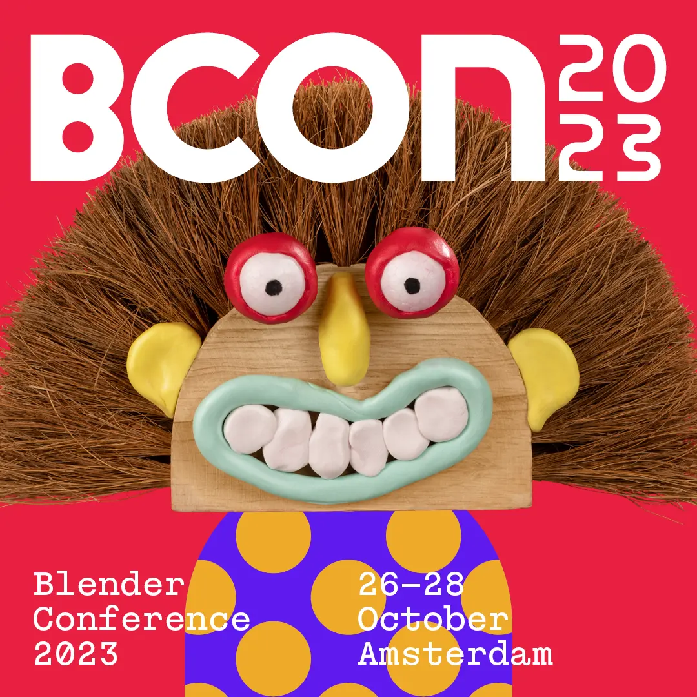



# Free & Open Source   Render Management

Here you can download the files for the [**Blender Conference Hands-On Class on Flamenco v3.3**][schedule].

[schedule]: https://conference.blender.org/2023/presentations/1862/

## 1. Download the blend file

Download BCON23 Demo Blend File

<!-- weirdly necessary for spacing while inside a <columns> -->

## 2. Download the Flamenco package

<table>
<tr><th> Platform</th><th>File                                                </th></tr>
<tr><td> Windows </td><td></td></tr>
<tr><td> Linux   </td><td>            </td></tr>
<tr><td> macOS   </td><td>            </td></tr>
</table>

<--->


