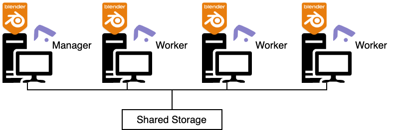

Flamenco is a true [blender.org](blender.org) project.  Flamenco is a lightweight, cross-platform framework to dispatch and schedule rendering jobs for smaller animation studios and individuals at home.

## Target Audience

Flamenco is meant for smaller animation studios and individuals at home. Think of roughly 1-10 artists using it, and 1-100 computers attached to the farm to execute tasks. 

Blender Studio uses various desktop machines for the render farm when they're not used by the artists, and some developer machines are powerful enough to run Flamenco and work on coding Blender at the same time.

There is no need to compile or build anything.  The Flamenco project distributes executables and a Blender Add-On for you to install and run.

## Design Principles

Here is a list of guiding principles for this Flamenco project...

1. Flamenco is a true blender.org project.  This means that it's Free and Open Source, made by the community, lead by Blender HQ. Its development will fall under the umbrella of the [Pipeline, Assets & IO](https://developer.blender.org/tag/pipeline_assets_i_o/) module.

2. Minimal Authentication & Organisation: Flamenco is aimed at small studios and individuals where application and user security are lower priorities.

3. Minimize External Dependencies: Running Flamenco should be straight forward to setup and run. Apart from the Flamenco components themselves, all you need to install is [Blender](https://www.blender.org/), [FFmpeg](https://ffmpeg.org/).

4. No Errors and Guide the User To Success: Instead of stopping with a "no database configured" error, Flamenco should show a helpful interface in which you're guided towards a working system.

5. Customisable: Studio pipeline developers / TDs should be able to customise the behaviour of Flamenco. They should be able to create new job types, and adjust existing job types to their needs.

6. Work offline: Like Blender itself, Flamenco should be able to fully work offline if required.

7. Data Storage: Flamenco data storage should be simple and not require any database support, such as a local [SQLite](https://sqlite.org/) database file on the Flamenco Manager workstation.

## Supported Platforms

Since Blender Studio fully runs on Open Source software, Linux is the main platform Flamenco is developed against. 
Windows and MacOS will also be supported, but best-effort with community testing.

## Infrastructure

Setting up a render farm is not simple but Flamenco aims to keep things as simple as possible.  

For the simplest deployment, Flamenco is:

1. One or more computers to do the work, i.e. running Flamenco Worker. These machines also need [Blender](https://www.blender.org/) and [FFmpeg](https://ffmpeg.org/) for video processing.
2. A computer to run the Flamenco Manager. This could be one of the above computers, or a dedicated one.
3. A local network with file sharing already set up, so that the above computers can all reach the same set of files.

