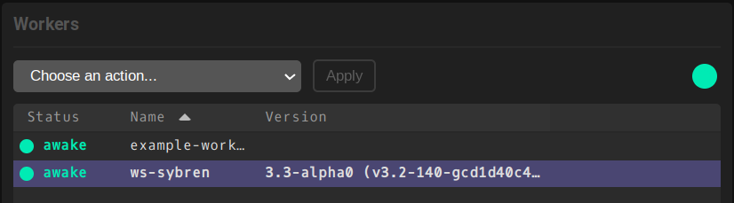

The Worker Actions menu can be found in the *Workers* tab of Flamenco Manager's
web interface. By default it shows *Choose an action...*, and the *Apply* button
will be disabled until a specific action is chosen. The available actions are:

<style>
  sup {
    color: red;
  }
</style>

| Label                   | Effect                                                                                                                                                                                       |
|-------------------------|----------------------------------------------------------------------------------------------------------------------------------------------------------------------------------------------|
| Shut Down               | Stop the worker. It will exit with status code `0`, indicating a clean shutdown.                                                                                                             |
| Restart                 | Stop the worker. It will exit with the configured status code, indicating a desire to restart. This option is only available when the selected worker is marked as 'restartable'. See below. |
| Send&nbsp;to&nbsp;Sleep | Let the worker sleep. It will not get any new task, just check every 30 seconds to see if it should wake up.                                                                                 |
| Wake Up                 | Wake the worker up. A sleeping worker can take a while to respond.                                                                                                                           |

Most actions have two 'flavors':

After task is finished
: Wait until the current task is done, then perform the action. A new task will not be assigned to this worker until it has confirmed the status change.

Immediately
: Abort the current task, and return it to the Manager for requeueing. Then perform the action.


## Shut Down & Restart actions

Both the 'Shut Down' and 'Restart' actions stop the Worker process.

Shutting down the worker will make it exit succesfully, with status code `0`.

Restarting the worker is only possible if it was started or configured with a
'restart exit code'. This can be done by using the `-restart-exit-status 47`
commandline option, or by settings this code in the [worker config file][wconfig].
Requesting a worker restart will make it exit with the configured status code.

It is up to the process management system (for example [systemd][systemd]) to
respond to these exit status code correctly. Here is an example systemd service
unit file that shows how to set this up on Linux:

```systemd
[Unit]
Description=Flamenco Worker connecting to Manager on localhost
Documentation=https://localhost:8080/
After=network.target

[Service]
Type=simple
CPUSchedulingPolicy=idle
Nice=19

WorkingDirectory=/home/flamenco
# Tell the Worker that it should exit with status code 47 in order to restart.
ExecStart=/home/flamenco/flamenco-worker -manager http://localhost:8080/ -restart-exit-code 47

User=flamenco
Group=flamenco

# Make systemd restart the service on exit code 47, as well as
# 'failure' codes (such as hard crashes).
RestartForceExitStatus=47
Restart=on-failure

EnvironmentFile=-/etc/default/locale

[Install]
WantedBy=multi-user.target
```

[wconfig]: 
[systemd]: https://systemd.io/


The 'Shut Down' and 'Restart' actions only relate to the Flamenco Worker process. They do **not** shut down or restart the computer itself.

